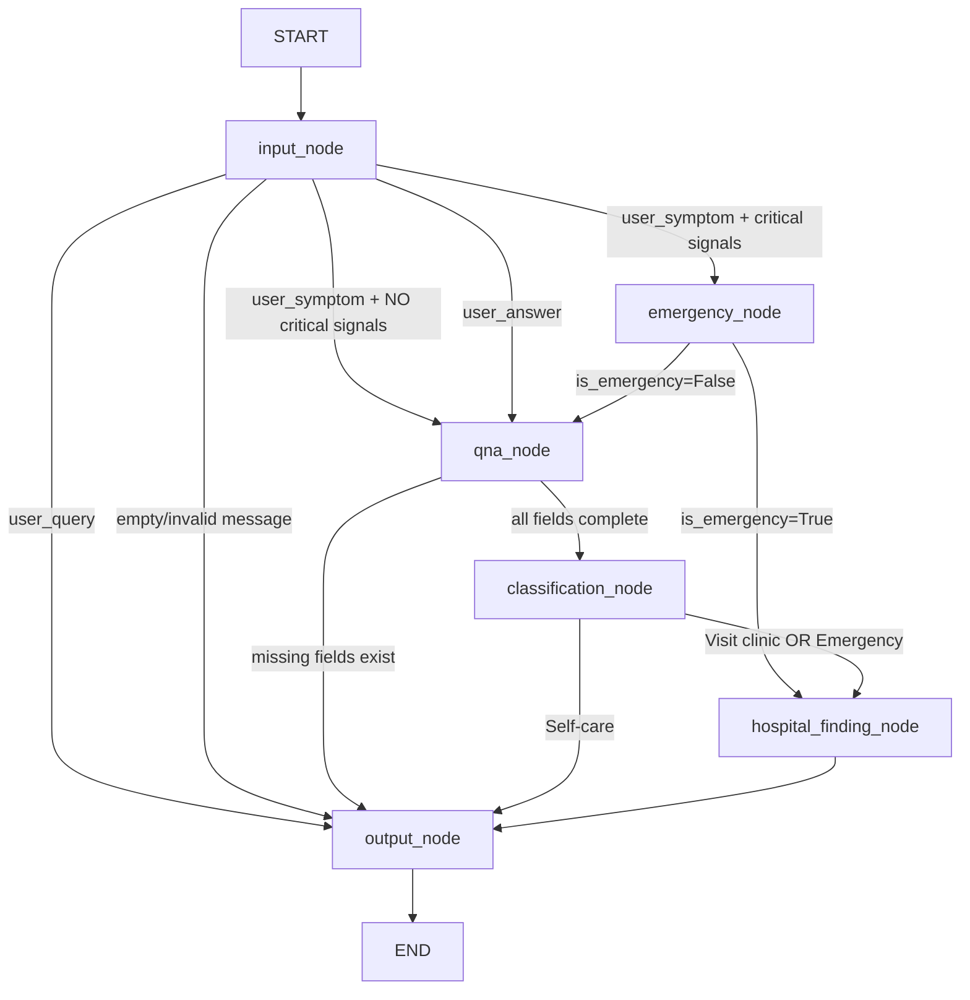

# Healthcare Triage Chatbot — Technical Blueprint

> **Purpose**: This document is the single source of truth for the Sonnet implementation engineer.
> Every design decision, state field, edge path, LLM contract, and safety measure is specified here.
> This document supersedes the XML spec wherever they conflict.

---

## 1. Architecture Overview & Design Decision Review

### Key Architectural Change: XML spec vs Reality

The XML spec calls for **Claude Sonnet via Anthropic SDK**. Your existing codebase already uses **Groq-hosted LLMs via LangChain**. This blueprint assumes **Groq stays** (as you configured in [config.py](file:///c:/Users/Jayveer/OneDrive/Pictures/Desktop/Projects/Hackathons/AETRIX2026-PDEU/backend/chatbot/config.py)) — the LLM choice is not the hard part of this system. If you want to switch to Anthropic, only [config.py](file:///c:/Users/Jayveer/OneDrive/Pictures/Desktop/Projects/Hackathons/AETRIX2026-PDEU/backend/chatbot/config.py) and the LLM client initialization in [workflow.py](file:///c:/Users/Jayveer/OneDrive/Pictures/Desktop/Projects/Hackathons/AETRIX2026-PDEU/backend/chatbot/workflow.py) need to change.

The XML also prescribes 4 files ([schemas.py](file:///c:/Users/Jayveer/OneDrive/Pictures/Desktop/Projects/Hackathons/AETRIX2026-PDEU/backend/chatbot/schemas.py), `system_prompts.py`, [workflow.py](file:///c:/Users/Jayveer/OneDrive/Pictures/Desktop/Projects/Hackathons/AETRIX2026-PDEU/backend/chatbot/workflow.py), `api.py`). Your existing structure already has [schemas.py](file:///c:/Users/Jayveer/OneDrive/Pictures/Desktop/Projects/Hackathons/AETRIX2026-PDEU/backend/chatbot/schemas.py), [system_prompt.py](file:///c:/Users/Jayveer/OneDrive/Pictures/Desktop/Projects/Hackathons/AETRIX2026-PDEU/backend/chatbot/system_prompt.py), [workflow.py](file:///c:/Users/Jayveer/OneDrive/Pictures/Desktop/Projects/Hackathons/AETRIX2026-PDEU/backend/chatbot/workflow.py), [main.py](file:///c:/Users/Jayveer/OneDrive/Pictures/Desktop/Projects/Hackathons/AETRIX2026-PDEU/backend/chatbot/main.py), [chatbot.py](file:///c:/Users/Jayveer/OneDrive/Pictures/Desktop/Projects/Hackathons/AETRIX2026-PDEU/backend/chatbot/chatbot.py), [memory.py](file:///c:/Users/Jayveer/OneDrive/Pictures/Desktop/Projects/Hackathons/AETRIX2026-PDEU/backend/chatbot/memory.py), and [config.py](file:///c:/Users/Jayveer/OneDrive/Pictures/Desktop/Projects/Hackathons/AETRIX2026-PDEU/backend/chatbot/config.py). **I recommend keeping your existing file structure** and adapting the XML's design into it rather than nuking what's already approved.

### Files That Need Complete Rewriting

| File | Action | Reason |
|---|---|---|
| [schemas.py](file:///c:/Users/Jayveer/OneDrive/Pictures/Desktop/Projects/Hackathons/AETRIX2026-PDEU/backend/chatbot/schemas.py) | **REWRITE** | Needs GraphState TypedDict, all API models, and session models |
| [system_prompt.py](file:///c:/Users/Jayveer/OneDrive/Pictures/Desktop/Projects/Hackathons/AETRIX2026-PDEU/backend/chatbot/system_prompt.py) | **REWRITE** | Needs 8 specialized prompts, not 1 generic one |
| [workflow.py](file:///c:/Users/Jayveer/OneDrive/Pictures/Desktop/Projects/Hackathons/AETRIX2026-PDEU/backend/chatbot/workflow.py) | **REWRITE** | Entirely new 6-node LangGraph graph |
| [chatbot.py](file:///c:/Users/Jayveer/OneDrive/Pictures/Desktop/Projects/Hackathons/AETRIX2026-PDEU/backend/chatbot/chatbot.py) | **REWRITE** | New session management + graph invocation logic |
| [main.py](file:///c:/Users/Jayveer/OneDrive/Pictures/Desktop/Projects/Hackathons/AETRIX2026-PDEU/backend/chatbot/main.py) | **MODIFY** | Add `/session/{session_id}` GET/DELETE endpoints, logging middleware |
| [memory.py](file:///c:/Users/Jayveer/OneDrive/Pictures/Desktop/Projects/Hackathons/AETRIX2026-PDEU/backend/chatbot/memory.py) | **KEEP AS-IS** | Mem0 integration stays — but de-prioritized; session store is primary |
| [config.py](file:///c:/Users/Jayveer/OneDrive/Pictures/Desktop/Projects/Hackathons/AETRIX2026-PDEU/backend/chatbot/config.py) | **MODIFY** | Add API URLs for external services, emergency keyword list |

### New Files Needed

| File | Purpose |
|---|---|
| `api_clients.py` | External API caller wrappers (emergency, classification, hospital) |
| `session_store.py` | In-memory session store with asyncio.Lock, swappable for Redis |

---

## 2. Complete `GraphState` TypedDict

Every field, its type, its default, and which node owns (writes) vs reads it.

```python
class GraphState(TypedDict, total=False):
    # ── IMMUTABLE INPUTS (set once before graph invocation) ──────────
    user_message: str                    # Raw user text. Set by: API layer. Read by: all nodes.
    user_id: str                         # Unique user ID. Set by: API layer. Read by: memory/session.
    session_id: str                      # Session ID. Set by: API layer. Read by: all nodes.

    # ── INPUT CLASSIFICATION (written by input_node) ────────────────
    input_type: str                      # "user_symptom" | "user_query" | "user_answer". Default: "".
    extracted_symptoms: list[str]        # Symptoms pulled from message. Default: [].
    urgency_signals: list[str]           # Critical keywords/signals. Default: [].
    classification_confidence: float     # LLM confidence in classification. Default: 0.0.

    # ── TRIAGE FIELDS (written by input_node + qna_node) ────────────
    symptom_severity: float | None       # 0.0–1.0. Default: None. Written by: input_node, qna_node.
    symptom_count: int | None            # Number of distinct symptoms. Default: None.
    duration: str | None                 # e.g. "3 days". Default: None.
    patient_age_risk: str | None         # "low" | "medium" | "high". Default: None.
    comorbidity_flag: bool | None        # Pre-existing conditions. Default: None.
    user_location: str | None            # City or coords. Default: None.

    # ── QNA STATE (written by qna_node) ─────────────────────────────
    asked_questions: list[str]           # Questions already asked this session. Default: [].
    pending_question: str | None         # Current question waiting for answer. Default: None.
    missing_fields: list[str]            # Fields still needed. Default: [].

    # ── EMERGENCY STATE (written by emergency_node) ─────────────────
    is_emergency: bool | None            # API result. Default: None.
    emergency_confidence: float | None   # API confidence. Default: None.
    emergency_reason: str | None         # API reason string. Default: None.
    emergency_api_failed: bool           # True if API call failed. Default: False.

    # ── CLASSIFICATION STATE (written by classification_node) ───────
    urgency_score: float | None          # 0.0–1.0. Default: None.
    urgency_label: str | None            # "Self-care" | "Visit clinic" | "Emergency". Default: None.
    classification_api_failed: bool      # True if API fell back to rules. Default: False.

    # ── HOSPITAL STATE (written by hospital_finding_node) ───────────
    hospital_data: list[dict] | None     # List of hospital dicts from API. Default: None.
    hospital_api_failed: bool            # True if API failed. Default: False.

    # ── OUTPUT STATE (written by output_node) ────────────────────────
    output_mode: str                     # "query"|"answer"|"suggestions"|"clinic"|"emergency". Default: "".
    final_response: dict | None          # Complete response payload. Default: None.

    # ── CONVERSATION HISTORY (accumulated across turns) ─────────────
    conversation_history: list[dict]     # [{role, content}]. Capped at 20 turns. Default: [].

    # ── ROUTING FLAGS (internal, set by nodes for edge functions) ───
    route_to: str                        # Next node hint. Default: "". Used by conditional edges.

    # ── ERROR TRACKING ──────────────────────────────────────────────
    error_message: str | None            # Set if any node encounters a fatal error. Default: None.
```

> [!IMPORTANT]
> `total=False` is critical — LangGraph state updates are partial dicts. Every field must tolerate being absent.

---

## 3. Complete Graph Topology — All Paths Enumerated

### Graph Visualization



### All End-to-End Paths (Exhaustive)

| # | Path | Turns | Trigger |
|---|---|---|---|
| **P1** | input → emergency → hospital → output → END | 1 | Emergency symptom detected + API confirms |
| **P2** | input → emergency → qna → output(query) → END | 1 | Emergency symptom detected + API rejects (not emergency) + fields missing |
| **P3** | input → emergency → qna → classification → output(suggestions) → END | 1 | Emergency rejected + all fields present + Self-care score |
| **P4** | input → emergency → qna → classification → hospital → output(clinic/emergency) → END | 1 | Emergency rejected + all fields present + elevated score |
| **P5** | input → qna → output(query) → END | 1 | Non-critical symptom + missing fields → asks question |
| **P6** | input → qna → classification → output(suggestions) → END | 1 | Non-critical symptom + all fields extractable from message + Self-care |
| **P7** | input → qna → classification → hospital → output(clinic) → END | 1 | All fields present + Visit clinic score |
| **P8** | input → qna → classification → hospital → output(emergency) → END | 1 | All fields present + Emergency score |
| **P9** | input → output(answer) → END | 1 | General health query |
| **P10** | input → output(error) → END | 1 | Empty/invalid message |

### Multi-Turn QnA Loop (Across Graph Invocations)

The QnA loop is **NOT an in-graph cycle**. Each turn is a **separate graph invocation**:

```
Turn 1: User sends symptom → P5 path → output(query) → END → returns question
Turn 2: User sends answer  → input(user_answer) → qna → output(query) → END → returns next question
Turn 3: User sends answer  → input(user_answer) → qna → classification → ... → END → returns final result
```

> [!IMPORTANT]
> The loop lives in the **session store**, not in the graph. The graph is stateless per invocation.
> Accumulated triage fields persist in the session store between invocations and are injected into
> the initial GraphState at the start of each invocation.

### Mid-Session Emergency Interrupt

```
Turn 1: User: "I have a mild headache" → qna → asks about severity → question returned
Turn 2: User: "Actually I can't see out of my left eye and my speech is slurring"
         → input_node: input_type=user_symptom (NOT user_answer), urgency_signals=[vision_loss, slurred_speech]
         → emergency_node → hospital → output(emergency) → END
```

This works because **input_node re-classifies every message from scratch**. The LLM classifier decides fresh each turn.

---

## 4. Three Contested Design Decisions — Verdict

### 4a. Should `user_answer` bypass `input_node`?

**Verdict: NO — input_node MUST process every message. The XML design is CORRECT.**

**Reasoning:**
- Bypassing input_node means a user who answers "my chest is really hurting now and I can't breathe" would be routed to qna_node to extract a severity number, instead of being flagged as an emergency.
- Every user message, regardless of context, must pass through emergency signal detection.
- The overhead is one LLM call per turn. This is acceptable for a medical system where a missed emergency is a **life-safety failure**.

> [!CAUTION]
> Any implementation that routes `user_answer` directly to `qna_node` has a patient safety hole.

### 4b. Is LLM-based emergency detection in `input_node` safe enough?

**Verdict: INSUFFICIENT — add a keyword pre-filter BEFORE the LLM call.**

**Reasoning:**
- LLMs can fail: hallucinate, ignore instructions, return malformed JSON, or time out.
- Keyword list (hardcoded): `chest pain, can't breathe, difficulty breathing, stroke, paralysis, seizure, unconscious, severe bleeding, suicidal, self-harm, overdose, anaphylaxis, choking`
- If ANY of these keywords are present in `user_message` (case-insensitive), the system MUST:
  - Set `urgency_signals` to include the matched keyword
  - Force `route_to = "emergency_node"` **regardless of LLM output**
- The LLM classifier still runs (for richer extraction) but the routing decision is overridden.

```python
CRITICAL_KEYWORDS = [
    "chest pain", "can't breathe", "cannot breathe", "difficulty breathing",
    "heart attack", "stroke", "paralysis", "seizure", "unconscious",
    "passed out", "severe bleeding", "won't stop bleeding",
    "suicidal", "kill myself", "self-harm", "overdose",
    "anaphylaxis", "allergic reaction", "choking", "can't swallow",
    "sudden severe headache", "worst headache",
]

def check_critical_keywords(message: str) -> list[str]:
    message_lower = message.lower()
    return [kw for kw in CRITICAL_KEYWORDS if kw in message_lower]
```

> [!WARNING]
> This is a **belt-and-suspenders** approach. Both the keyword filter AND the LLM check run.
> The keyword filter acts as a safety net that never depends on a probabilistic model.

### 4c. One [output_node](file:///c:/Users/Jayveer/OneDrive/Pictures/Desktop/Projects/Hackathons/AETRIX2026-PDEU/backend/chatbot/workflow.py#132-144) with 5 modes vs. 5 separate terminal nodes?

**Verdict: KEEP the single output_node with 5 modes. The XML design is CORRECT.**

**Reasoning:**
- Every output mode needs: disclaimer injection, conversation history append, session save, response formatting. A single node avoids duplicating this logic across 5 nodes.
- The mode switch is a simple `if/elif` on `output_mode`. Not complex enough to warrant separation.
- If it grows beyond 5 modes, refactor later. YAGNI for now.
- Separate nodes would add 4 extra edges to the graph with no correctness benefit.

---

## 5. Exact JSON Contracts for Every LLM Call

### 5.1 Input Classifier (input_node)

**Input to LLM:**
```json
{
  "system": "INPUT_CLASSIFIER_PROMPT (see system_prompts.py)",
  "user": "Classify this message:\n\n\"{user_message}\"\n\nConversation context: {last 3 turns from conversation_history}\nPending question from bot: \"{pending_question or 'None'}\""
}
```

**Expected LLM Output:**
```json
{
  "input_type": "user_symptom",
  "extracted_symptoms": ["chest pain", "shortness of breath"],
  "extracted_answer_fields": {
    "symptom_severity": 0.8,
    "symptom_count": 2,
    "duration": "30 minutes",
    "patient_age_risk": "high",
    "comorbidity_flag": null,
    "user_location": null
  },
  "urgency_signals": ["chest_pain", "breathing_difficulty"],
  "confidence": 0.95
}
```

**Fallback on parse failure:** `input_type = "user_symptom"`, empty extracted fields, route to qna_node. **NEVER** silently drop a message — always assume it could be a symptom.

### 5.2 QnA Answer Processor (qna_node — when input_type = "user_answer")

**Input to LLM:**
```json
{
  "system": "QNA_ANSWER_PROCESSOR_PROMPT",
  "user": "The patient was asked: \"{pending_question}\"\nThey replied: \"{user_message}\"\n\nExtract the answer value for the relevant triage field.\nCurrently missing fields: {missing_fields}\nAlready known: severity={symptom_severity}, count={symptom_count}, duration={duration}, age_risk={patient_age_risk}, comorbidity={comorbidity_flag}"
}
```

**Expected LLM Output:**
```json
{
  "extracted_fields": {
    "symptom_severity": 0.4,
    "symptom_count": null,
    "duration": null,
    "patient_age_risk": null,
    "comorbidity_flag": null
  },
  "could_not_extract": false,
  "reasoning": "Patient rated headache at 4/10, mapped to 0.4 severity"
}
```

### 5.3 QnA Question Generator (qna_node — when fields are missing)

**Input to LLM:**
```json
{
  "system": "QNA_QUESTION_GENERATOR_PROMPT",
  "user": "Patient symptoms: {extracted_symptoms}\nMissing fields (in priority order): {missing_fields}\nAlready asked questions: {asked_questions}\nGenerate the next triage question."
}
```

**Expected LLM Output:**
```json
{
  "question": "I'd like to understand your symptoms better. How long have you been experiencing this headache and fever?",
  "target_field": "duration",
  "reasoning": "Duration is the highest priority missing field that hasn't been asked about."
}
```

### 5.4 Output Node — All 5 Modes

Each mode uses a different system prompt but the **output schema is identical**:

```json
{
  "output_type": "suggestions",
  "urgency_label": "Self-care",
  "message": "Based on what you've described...",
  "action_items": [
    "Take ibuprofen for pain relief",
    "Stay hydrated with clear fluids",
    "Rest in a dark, quiet room"
  ],
  "hospital_info": null,
  "disclaimer": "This is informational guidance, not a medical diagnosis...",
  "session_complete": true
}
```

For `clinic` and `emergency` modes, `hospital_info` is populated:
```json
{
  "hospital_info": {
    "hospitals": [
      {
        "name": "City General Hospital",
        "address": "123 Main St",
        "distance_km": 2.3,
        "phone": "+91-123-456-7890",
        "open_now": true
      }
    ]
  }
}
```

For `query` mode, `session_complete` is **always `false`** (the conversation continues).

---

## 6. External API Retry & Fallback Behavior

### 6.1 Emergency Check API (`POST /api/emergency-check`)

| Aspect | Spec |
|---|---|
| Timeout | 5 seconds |
| Retries | 2 (total 3 attempts) |
| Retry delay | 1 second between retries |
| **On failure** | `is_emergency = False`, `emergency_api_failed = True` |
| **State after failure** | Route to `qna_node` (continues normal triage) |

> [!WARNING]
> Defaulting `is_emergency=False` on API failure means a real emergency could be missed.
> The **keyword pre-filter (Section 4b)** mitigates this — if keywords matched, the system already
> routed to emergency_node, so the API failure happens AFTER the emergency decision was made.

### 6.2 Classification API (`POST /api/classify-urgency`)

| Aspect | Spec |
|---|---|
| Timeout | 8 seconds |
| Retries | 2 (total 3 attempts) |
| **On failure** | Use rule-based fallback formula |
| **Fallback formula** | `score = (severity × 0.4) + (comorbidity × 0.3) + (age_risk_score × 0.3)` |
| Age risk mapping | `low=0.2, medium=0.5, high=0.9` |
| Comorbidity mapping | `True=1.0, False=0.0` |
| `classification_api_failed` | Set to `True` |

**Score interpretation (same as API):**
- `0.00–0.39` → Self-care
- `0.40–0.74` → Visit clinic  
- `0.75–1.00` → Emergency
- **At exact boundaries (0.40, 0.75)** → use the **more urgent label** (conservative)

### 6.3 Hospital Finder API (`POST /api/find-hospital`)

| Aspect | Spec |
|---|---|
| Timeout | 10 seconds |
| Retries | 1 (total 2 attempts) |
| **On failure** | `hospital_data = None`, `hospital_api_failed = True` |
| **On no location** | Skip API call entirely, `hospital_data = None` |
| **output_node behavior** | Tells user to search manually or call emergency services |

---

## 7. Top 5 Implementation Bugs to Watch For

### Bug #1: QnA Infinite Loop — Session Triage Fields Not Injected

**Where:** API layer → initial GraphState construction  
**Failure:** The graph is invoked on Turn 2 with an empty GraphState. The session store has `symptom_severity=0.4` from Turn 1, but nobody copies it into the new invocation's initial state. QnA thinks all fields are missing and re-asks the same question forever.

**Fix:** At every graph invocation, the API layer **MUST** hydrate `GraphState` from the session store:
```python
initial_state = {**default_state, **session.triage_fields, "user_message": request.message}
```

### Bug #2: LLM Returns `input_type = "user_answer"` for Emergency Text

**Where:** `input_node` classifier LLM call  
**Failure:** User was asked "how severe is your headache?" and replies "it's so bad I want to die." The LLM classifies this as `user_answer` (because the bot asked a question). The emergency signal "suicidal" is missed. User gets routed to qna_node instead of emergency_node.

**Fix:** The keyword pre-filter (Section 4b) runs **BEFORE** the LLM classification and **OVERRIDES** the routing decision. Even if `input_type = "user_answer"`, if critical keywords match, route to `emergency_node`.

### Bug #3: `asked_questions` Not Persisted Across Turns

**Where:** `qna_node` question generation  
**Failure:** `asked_questions` is part of GraphState but the graph is invoked fresh each turn. If `asked_questions` isn't saved to the session store after each turn, qna_node will repeat the same question.

**Fix:** After graph invocation, the API layer must merge `asked_questions` and `pending_question` back into the session store.

### Bug #4: Edge Function Returns Invalid Node Name

**Where:** Conditional edge function after `input_node`  
**Failure:** The edge router function returns a string like `"emergency"` instead of `"emergency_node"`. LangGraph silently fails or throws a cryptic error.

**Fix:** Use an `Enum` or constants for all node names. Validate edge function return values.

### Bug #5: Race Condition on Session Store

**Where:** `session_store.py` — concurrent requests for same session  
**Failure:** Two messages from the same user arrive simultaneously. Both read the session, both update it, one overwrites the other's field updates.

**Fix:** Use `asyncio.Lock` **per session_id** (not a global lock, which would serialize all users):
```python
self._locks: dict[str, asyncio.Lock] = defaultdict(asyncio.Lock)
async with self._locks[session_id]:
    # read, update, write
```

---

## 8. Patient Safety Risk Analysis

> [!CAUTION]
> This system makes triage decisions for real patients. The following are life-safety risks.

### Risk #1: Emergency API Failure Defaults to `is_emergency=False` (CRITICAL)

**Scenario:** Patient says "I have severe chest tightness." Keyword pre-filter catches "chest" but it's not in the critical keywords list (only "chest pain" is). LLM classifies as symptom with urgency signals. Routes to emergency_node. Emergency API times out. System defaults to `is_emergency=False`. Patient is sent to QnA loop.

**Mitigation:** If `emergency_api_failed = True` AND `urgency_signals` is non-empty, **default to `is_emergency=True`** instead. Conservative. Better to over-triage than under-triage.

**Updated logic:**
```python
if api_failed and len(state["urgency_signals"]) > 0:
    is_emergency = True  # Conservative: if we suspect AND can't verify, assume worst case
```

### Risk #2: LLM Confidence Threshold Not Enforced

**Scenario:** LLM classifier returns `input_type = "user_query"` with `confidence = 0.3` for "I feel like I'm dying." User gets a general health answer instead of emergency triage.

**Mitigation:** If `confidence < 0.6` and the message contains body-related words (pain, hurt, sick, feel, symptom), force `input_type = "user_symptom"`. Default to the safer classification.

### Risk #3: QnA Loop Timeout — Patient Waiting Too Long

**Scenario:** The bot asks 5 questions. User answers 3 but gets frustrated and stops responding. Session hangs with incomplete triage data forever.

**Mitigation:** Add a `max_questions` limit (suggest: 5). If qna_node has asked `max_questions` questions and fields are still missing, **use conservative defaults** for missing fields and proceed to classification:
- `symptom_severity`: default `0.6` (moderate-high)
- `symptom_count`: default `1`
- `duration`: default `"unknown"`
- `patient_age_risk`: default `"medium"`
- `comorbidity_flag`: default `False`

### Risk #4: Self-Care Advice for Masking Conditions

**Scenario:** Patient reports mild abdominal pain, no comorbidities, young age. Score = 0.25 → Self-care. But the pain is actually appendicitis. Self-care advice delays critical surgery.

**Mitigation:** The OUTPUT_SUGGESTIONS_PROMPT **must** include condition-specific red flags. The XML spec already mandates this (safety_rules, priority=HIGH). Enforce it in the prompt:
```
You MUST include a "Warning Signs" section listing at least 3 red-flag symptoms 
that would require immediate medical attention. For abdominal pain, always mention: 
pain moving to lower right, fever above 101°F, vomiting, inability to pass gas.
```

### Risk #5: `comorbidity_flag` False Negative

**Scenario:** User doesn't mention diabetes because they weren't asked. `comorbidity_flag` defaults to `None → False` in the fallback formula. This under-estimates the urgency score by 0.3 points — potentially dropping an Emergency to Visit clinic.

**Mitigation:** `comorbidity_flag` MUST be explicitly asked as a question, never left as `None` at classification time. If after `max_questions` it's still `None`, default to `False` but add a note in the output: "If you have any pre-existing conditions, please let your doctor know."

---

## 9. Proposed File Changes Summary

### Files to Rewrite (from XML spec adapted to existing structure)

| File | What changes |
|---|---|
| [schemas.py](file:///c:/Users/Jayveer/OneDrive/Pictures/Desktop/Projects/Hackathons/AETRIX2026-PDEU/backend/chatbot/schemas.py) | GraphState TypedDict, InputRequest, OutputResponse, all API models, SessionData |
| [system_prompt.py](file:///c:/Users/Jayveer/OneDrive/Pictures/Desktop/Projects/Hackathons/AETRIX2026-PDEU/backend/chatbot/system_prompt.py) | 8 specialized prompts replacing the generic one |
| [workflow.py](file:///c:/Users/Jayveer/OneDrive/Pictures/Desktop/Projects/Hackathons/AETRIX2026-PDEU/backend/chatbot/workflow.py) | 6-node LangGraph graph with conditional edges, API callers, LLM utility |
| [chatbot.py](file:///c:/Users/Jayveer/OneDrive/Pictures/Desktop/Projects/Hackathons/AETRIX2026-PDEU/backend/chatbot/chatbot.py) | Session-aware graph invocation, state hydration from session |
| [main.py](file:///c:/Users/Jayveer/OneDrive/Pictures/Desktop/Projects/Hackathons/AETRIX2026-PDEU/backend/chatbot/main.py) | Add session endpoints, logging middleware |

### New Files

| File | Purpose |
|---|---|
| `api_clients.py` | Async wrappers for 3 external APIs with retry/timeout/fallback |
| `session_store.py` | In-memory session store with per-session asyncio.Lock |

---

## 10. Implementation Order

> [!TIP]
> This order ensures each file can be tested independently before integration.

1. **[schemas.py](file:///c:/Users/Jayveer/OneDrive/Pictures/Desktop/Projects/Hackathons/AETRIX2026-PDEU/backend/chatbot/schemas.py)** — All types first. Everything depends on this.
2. **`session_store.py`** — Session persistence. Independent module.
3. **[system_prompt.py](file:///c:/Users/Jayveer/OneDrive/Pictures/Desktop/Projects/Hackathons/AETRIX2026-PDEU/backend/chatbot/system_prompt.py)** — All 8 prompts. No code dependencies.
4. **`api_clients.py`** — External API wrappers. Depends only on schemas.
5. **[config.py](file:///c:/Users/Jayveer/OneDrive/Pictures/Desktop/Projects/Hackathons/AETRIX2026-PDEU/backend/chatbot/config.py)** — Add new config values (API URLs, keywords).
6. **[workflow.py](file:///c:/Users/Jayveer/OneDrive/Pictures/Desktop/Projects/Hackathons/AETRIX2026-PDEU/backend/chatbot/workflow.py)** — The graph. Depends on schemas, prompts, api_clients, config.
7. **[chatbot.py](file:///c:/Users/Jayveer/OneDrive/Pictures/Desktop/Projects/Hackathons/AETRIX2026-PDEU/backend/chatbot/chatbot.py)** — Orchestrator. Depends on workflow, session_store.
8. **[main.py](file:///c:/Users/Jayveer/OneDrive/Pictures/Desktop/Projects/Hackathons/AETRIX2026-PDEU/backend/chatbot/main.py)** — API layer. Depends on chatbot, schemas.

---

## Summary of Changes from XML Spec

| XML Says | Blueprint Says | Reason |
|---|---|---|
| Claude Sonnet via Anthropic | Keep Groq via LangChain | Already configured, model-agnostic design |
| 4 files | 9 files (existing 7 + 2 new) | Better separation of concerns for your existing codebase |
| LLM-only emergency detection | Keyword pre-filter + LLM | Patient safety — LLMs are probabilistic |
| `is_emergency=False` on API failure | `is_emergency=True` if urgency signals present | Conservative triage — over-triage is safer |
| Unlimited QnA questions | Max 5 questions then use defaults | Prevent infinite loops and user frustration |
| No confidence threshold | Force `user_symptom` if confidence < 0.6 | Safety — uncertain classification defaults to symptom |
